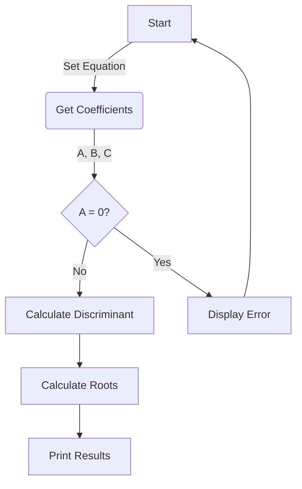

```mermaid
graph TD
  A[Start] -->|Set Equation| B(Get Coefficients)
  B -->|A, B, C| C{A = 0?}
  C -- No --> D[Calculate Discriminant]
  D --> E[Calculate Roots]
  E --> F[Print Results]
  C -- Yes --> G[Display Error]
  G --> A
```
