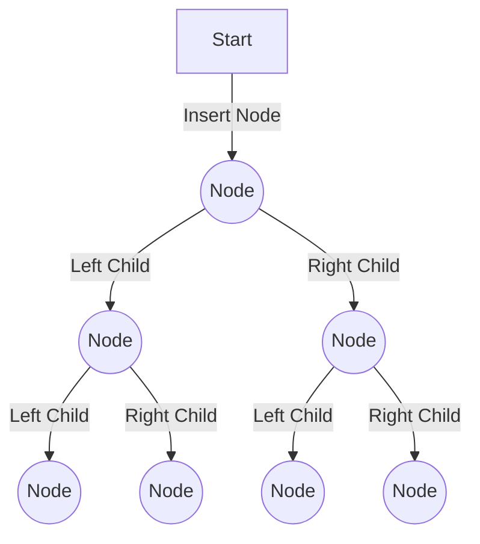
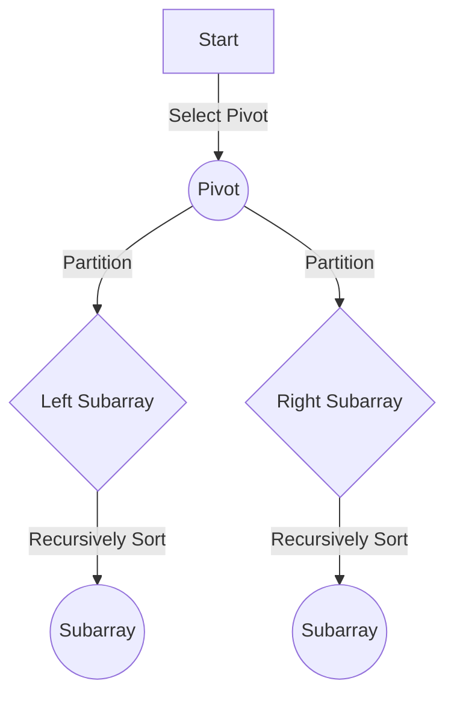

## Binary Search Tree

```mermaid
graph TD
    A[Start] -->|Insert Node| B((Node))
    B -->|Left Child| C((Node))
    B -->|Right Child| D((Node))
    C -->|Left Child| E((Node))
    C -->|Right Child| F((Node))
    D -->|Left Child| G((Node))
    D -->|Right Child| H((Node))
```

## Quick Sort

```mermaid
graph TD
    A[Start] -->|Select Pivot| B((Pivot))
    B -->|Partition| C1{Left Subarray}
    B -->|Partition| C2{Right Subarray}
    C1 -->|Recursively Sort| D1((Subarray))
    C2 -->|Recursively Sort| D2((Subarray))
```
