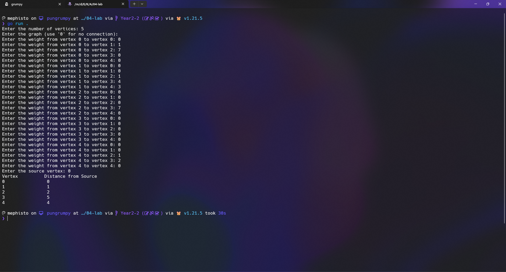

<div align="center">
    <h1>Shortest Path</h1>
    <sub>Program to find the shortest path between two vertices in a graph using Dijkstra's Algorithm</sub>
    <br /> 
    <br />
    
</div>

## 📖 Description

โปรแกรมนี้เป็นโปรแกรมที่ใช้ในการหา Shortest Path โดยใช้ Algorithm ของ Dijkstra's Algorithm

### 1. การสร้าง Graph

โปรแกรมจะทำการสร้างโครงสร้าง Graph เพื่อแทนการเชื่อมต่อระหว่างจุดที่ต่างกัน

- **Graph Structure**: โครงสร้างของ `Graph` ประกอบด้วยจำนวนของจุดที่เชื่อมโยงและ Array 2 มิติ `edges` เพื่อแทนการเชื่อมต่อระหว่างจุด

```go
type Graph struct {
    numVertices int
    edges [][]int
}
```

- **Function `newGraph`**: ทำการสร้าง `Graph` ใหม่โดยกำหนดจำนวนของจุดที่เชื่อมโยง และจัดการสร้างพื้นที่ในหน่วยความจำสำหรับ `edges`

```go
func newGraph(numVertices int) *Graph {
	graph := &Graph{
		numVertices: numVertices,
		edges:       make([][]int, numVertices),
	}

	for i := range graph.edges {
		graph.edges[i] = make([]int, numVertices)
	}

	return graph
}
```

- **Function `addEdge`**: เพิ่มเส้นเชื่อมระหว่างจุดทั้งสองพร้อมกำหนดค่าน้ำหนักของเส้นเชื่อม

```go
func (g *Graph) addEdge(from, to, weight int) {
	g.edges[from][to] = weight
}
```

### 2. การหา Shortest Path

การทำงานของ Dijkstra's Algorithm ในโปรแกรมนี้มีขั้นตอนดังนี้

- **Function `shortestPath`**: ทำการหาใช้ Dijkstra's Algorithm เพื่อคำนวณเส้นทางที่สั้นที่สุดจากจุดเริ่มต้นไปยังจุดอื่นๆ

```go
func (g *Graph) shortestPath(src int) []int {
	dist := make([]int, g.numVertices)
	visited := make([]bool, g.numVertices)

	for i := range dist {
		dist[i] = inf
	}

	dist[src] = 0

	for count := 0; count < g.numVertices-1; count++ {
		u := g.minDistance(dist, visited)
		visited[u] = true

		for v := 0; v < g.numVertices; v++ {
			if !visited[v] && g.edges[u][v] != 0 && dist[u] != inf && dist[u]+g.edges[u][v] < dist[v] {
				dist[v] = dist[u] + g.edges[u][v] // make the new distance the sum of the current distance and the weight of the edge
			}
		}
	}

	return dist
}
```

- **Function `minDistance`**: หาจุดที่มีระยะทางน้อยที่สุดจากจุดเริ่มต้นในแต่ละรอบของการคำนวณ

```go
func (g *Graph) minDistance(dist []int, visited []bool) int {
	min := inf
	minIndex := -1

	for i, d := range dist {
		if !visited[i] && d <= min {
			min = d
			minIndex = i
		}
	}

	return minIndex
}
```

### 3. การรับ Input และแสดงผลลัพธ์

โปรแกรมจะทำการรับ Input จากผู้ใช้งาน

- **Function `getUserInput`**: ใช้รับข้อมูลจำนวนของจุดเชื่อมโยง และน้ำหนักของเส้นเชื่อมระหว่างจุดทั้งสอง

```go
func getUserInput(prompt string) int {
	var input int
	fmt.Print(prompt)
	_, err := fmt.Scanln(&input)
	if err != nil {
		fmt.Println("Please enter a valid number.")
		return getUserInput(prompt)
	}
	return input
}
```

โปรแกรมจะทำการแสดงผลลัพธ์ออกทางหน้าจอ

- **Function `printResult`**: ใช้แสดงผลลัพธ์ของการหา Shortest Path ออกทางหน้าจอ

```go
func (g *Graph) printResult(result []int) {
	fmt.Println("Vertex\t\tDistance from Source")
	for i, r := range result {
		fmt.Printf("%d \t\t %d\n", i, r)
	}
}
```

### 4. การทำงานของโปรแกรม

ใน function `main`

- ผู้ใช้ป้อนจำนวนของจุดที่เชื่อมโยงและน้ำหนักของเส้นเชื่อมระหว่างจุด และระบุจุดต้นทาง.
- โปรแกรมจะคำนวณและแสดงระยะทางที่สั้นที่สุดจากจุดต้นทางไปยังจุดอื่น ๆ โดยใช้อัลกอริทึม Dijkstra.

```go
func main() {
	numVertices := getUserInput("Enter the number of vertices: ")

	graph := newGraph(numVertices)

	fmt.Println("Enter the graph (use '0' for no connection):")
	for i := 0; i < numVertices; i++ {
		for j := 0; j < numVertices; j++ {
			weight := getUserInput(fmt.Sprintf("Enter the weight from vertex %d to vertex %d: ", i, j))
			graph.addEdge(i, j, weight)
		}
	}

	source := getUserInput("Enter the source vertex: ")

	result := graph.shortestPath(source)

	printResult(result)
}
```

## 📝 Pseudocode

```plaintext
Function: newGraph(Integers: numVertices)
    สร้างโครงสร้างกราฟใหม่ด้วยจำนวนจุดที่กำหนด
    กำหนดพื้นที่ให้กับอาร์เรย์ edges สำหรับแสดงการเชื่อมต่อของกราฟ

    ส่งคืนโครงสร้างกราฟใหม่

Function: addEdge(Integers: from, to, weight)
    เพิ่มเส้นเชื่อมระหว่างจุดทั้งสองพร้อมกำหนดค่าน้ำหนักของเส้นเชื่อม

Function: minDistance(Array: dist, Array: visited)
    หาจุดที่มีระยะทางน้อยที่สุดจากจุดเริ่มต้นในแต่ละรอบของการคำนวณ

Function: shortestPath(Integer: src)
    สร้างอาร์เรย์ dist[] เพื่อเก็บระยะทางที่สั้นที่สุดจากจุดต้นทาง
    สร้างอาร์เรย์ visited[] เพื่อติดตามจุดที่เคยเข้าชม
    กำหนดค่าเริ่มต้นให้ dist[] เป็น infinity และ visited[] เป็น false
    กำหนดค่า dist[src] เป็น 0

    วนลูปจำนวน numVertices - 1 รอบ:
        u = จุดใน dist[] ที่มีค่าระยะทางน้อยที่สุดและยังไม่เคยเข้าชม
        ทำเครื่องหมายว่า u เป็นจุดที่เคยเข้าชม

        สำหรับแต่ละจุด v:
            ถ้า v ยังไม่เคยเข้าชม และมีเส้นเชื่อมจาก u ไปยัง v:
                ถ้า dist[u] + weight(u, v) น้อยกว่า dist[v]:
                    ปรับปรุงค่า dist[v] เป็น dist[u] + weight(u, v)

    คืนค่า dist[]

Function: getUserInput(String: prompt)
    รับข้อมูลจากผู้ใช้งาน
    ถ้าผู้ใช้ป้อนข้อมูลไม่ถูกต้อง ให้แสดงข้อความแจ้งเตือน และรับข้อมูลใหม่จนกว่าจะถูกต้อง

    ส่งคืนข้อมูลที่ถูกต้อง

Function: printResult(Array: result)
    แสดงผลลัพธ์ของการหา Shortest Path ออกทางหน้าจอ

Function: main()
    ผู้ใช้ป้อนจำนวนของจุดที่เชื่อมโยงและน้ำหนักของเส้นเชื่อมระหว่างจุด และระบุจุดต้นทาง.
    โปรแกรมจะคำนวณและแสดงระยะทางที่สั้นที่สุดจากจุดต้นทางไปยังจุดอื่น ๆ โดยใช้อัลกอริทึม Dijkstra.
```

## 🎉 How to use

1. เปิด Command Prompt หรือ Terminal ขึ้นมา แล้วเข้าไปยัง Path ที่เก็บ Source Code ของโปรแกรม
2. พิมพ์คำสั่ง `go run main.go` เพื่อรันโปรแกรม
3. ป้อนจำนวนของจุดที่เชื่อมโยงและน้ำหนักของเส้นเชื่อมระหว่างจุด และระบุจุดต้นทาง
4. โปรแกรมจะแสดงผลลัพธ์ออกทางหน้าจอ
