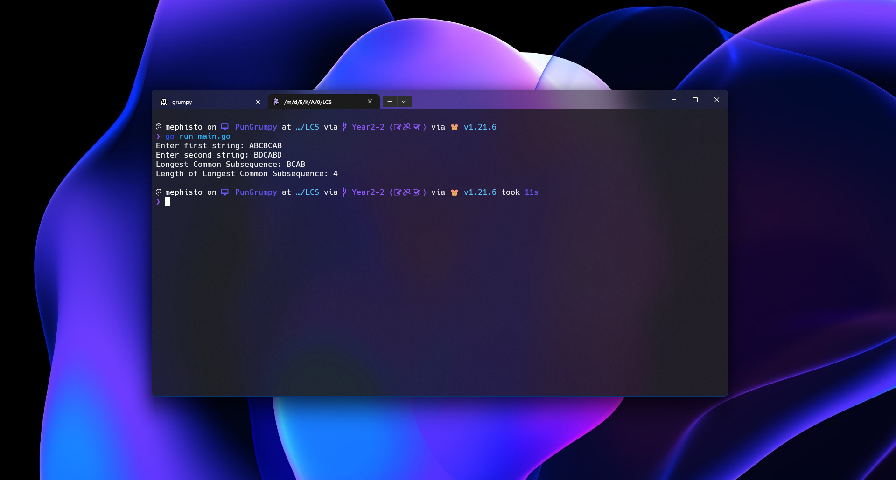

<div align="center">
    <h1>Longest Common Subsequence (LCS)</h1>
    <sub>Program to find the longest common subsequence between two strings.</sub>
    <br />
    <br />
    
</div>

## 📖 Description

โปรแกรมนี้ค้นหา **Longest Common Subsequence (LCS)** ระหว่างสองสตริง โดยคำนวณทั้งความยาวของ LCS และตัว LCS เอง แล้วแสดงผลให้กับผู้ใช้ LCS คือลำดับย่อยที่ยาวที่สุดที่ปรากฏในทั้งสองสตริงโดยไม่ทำให้ลำดับของอักขระเปลี่ยนแปลง

## 🎬 Functions

### LCS Struct

- **คำอธิบาย**: โครงสร้างข้อมูลสำหรับเมทริกซ์ LCS
- **ฟิลด์**:
  - `matrix`: เมทริกซ์ที่ใช้เก็บค่า LCS

```go
type LCS struct {
    matrix [][]int
}
```

### NewLCS

- **คำอธิบาย**: เริ่มต้น LCS ใหม่พร้อมจำนวนแถวและคอลัมน์ที่กำหนด
- **อินพุต**:
  - `rows`: จำนวนแถวสำหรับเมทริกซ์ LCS
  - `cols`: จำนวนคอลัมน์สำหรับเมทริกซ์ LCS
- **เอาต์พุต**: คืนค่าอินสแตนซ์ของ `LCS` สตรัค

```go
func NewLCS(rows, cols int) LCS {
	matrix := make([][]int, rows)
	for i := range matrix {
		matrix[i] = make([]int, cols)
	}
	return LCS{matrix: matrix}
}
```

### FindLCSLength

- **คำอธิบาย**: คำนวณความยาวของ LCS
- **อินพุต**:
  - `str1`: สตริงแรก
  - `str2`: สตริงที่สอง
- **เอาต์พุต**: คืนค่าความยาวของ LCS

```go
func (lcs *LCS) FindLCSLength(str1, str2 string) int {
    for i := 1; i <= len(str1); i++ {
        for j := 1; j <= len(str2); j++ {
            if str1[i-1] == str2[j-1] {
                lcs.matrix[i][j] = lcs.matrix[i-1][j-1] + 1
            } else {
                lcs.matrix[i][j] = int(math.Max(float64(lcs.matrix[i-1][j]), float64(lcs.matrix[i][j-1])))
            }
        }
    }
    return lcs.matrix[len(str1)][len(str2)]
}
```

### FindLCS

- **คำอธิบาย**: ดึงตัว LCS จริงๆ โดยใช้การย้อนกลับ
- **อินพุต**:
  - `str1`: สตริงแรก
  - `str2`: สตริงที่สอง
- **เอาต์พุต**: คืนค่าสตริง LCS

```go
func (l *LCS) FindLCS(str1, str2 string) string {
	i, j := len(str1), len(str2)
	var lcs string

	for i > 0 && j > 0 {
		if str1[i-1] == str2[j-1] {
			lcs = string(str1[i-1]) + lcs
			i--
			j--
		} else if l.matrix[i-1][j] > l.matrix[i][j-1] {
			i--
		} else {
			j--
		}
	}
	return lcs
}
```

### max

- **คำอธิบาย**: ฟังก์ชันยูทิลิตี้สำหรับหาค่าสูงสุดของสองจำนวนเต็ม
- **อินพุต**:
  - `a`: จำนวนเต็มแรก
  - `b`: จำนวนเต็มที่สอง
- **เอาต์พุต**: คืนค่าสูงสุดของสองจำนวน

```go
func max(a, b int) int {
	if a > b {
		return a
	}
	return b
}
```

### getUserInput

- **คำอธิบาย**: เรียกใช้งานข้อมูลจากผู้ใช้และอ่านสตริงจากอินพุตมาตรฐาน
- **อินพุต**:
  - `prompt`: ข้อความแจ้งเตือนที่จะแสดง
- **เอาต์พุต**: คืนค่าสตริงที่ผู้ใช้ป้อน

```go
func getUserInput(prompt string) string {
	var input string
	fmt.Print(prompt)
	_, err := fmt.Scanln(&input)
	if err != nil {
		fmt.Println("Invalid input. Please enter a valid string.")
		return getUserInput(prompt)
	}
	return input
}
```

### main

- **คำอธิบาย**: ฟังก์ชันหลักที่ขับเคลื่อนแอปพลิเคชัน มีการเรียกใช้ผู้ใช้สำหรับสองสตริงและใช้เมธอด LCS เพื่อค้นหาและแสดง LCS และความยาวของมัน

```go
func main() {
	str1 := getUserInput("Enter first string: ")
	str2 := getUserInput("Enter second string: ")

	lcs := NewLCS(len(str1)+1, len(str2)+1)
	lcs.FindLCSLength(str1, str2)
	lcsString := lcs.FindLCS(str1, str2)

	fmt.Printf("Longest Common Subsequence: %s\n", lcsString)
	fmt.Printf("Length of Longest Common Subsequence: %d\n", len(lcsString))
}
```

## 🔮 Pseudocode

### FindLCSLength Method

```pseudo
เริ่มต้นเมทริกซ์ขนาด (len(str1)+1) x (len(str2)+1)
    สำหรับแต่ละอักขระใน str1  (i):
        สำหรับแต่ละอักขระใน str2 (j):
            ถ้าอักขระใน str1 และ str2 ตรงกัน:
                อัปเดตเมทริกซ์[i][j] เป็นเมทริกซ์[i-1][j-1] + 1
            ไม่เช่นนั้น:
                อัปเดตเมทริกซ์[i][j] เป็น max(เมทริกซ์[i-1][j], เมทริกซ์[i][j-1])
คืนค่าเมทริกซ์[len(str1)][len(str2)]
```

### FindLCS Method

```pseudo
เริ่มต้น i เป็นความยาวของ str1
เริ่มต้น j เป็นความยาวของ str2
เริ่มต้น lcs เป็นสตริงว่าง
ขณะที่ i > 0 และ j > 0:
    ถ้าอักขระใน str1 และ str2 ตรงกัน:
        เติมอักขระที่ตรงกันไว้ด้านหน้าของ lcs
        ลด i และ j ลง
    ถ้าเมทริกซ์[i-1][j] > เมทริกซ์[i][j-1]:
        ลด i ลง
    ไม่เช่นนั้น:
        ลด j ลง
คืนค่า lcs
```

## 🧪 Testing

### Test Cases

| #   | Name                  | String 1  | String 2 | LCS      | Length | Status |
| --- | --------------------- | --------- | -------- | -------- | ------ | ------ |
| 1   | Basic LCS             | "AXYT"    | "AYZX"   | "AY"     | 2      | ✅     |
| 2   | Same Strings          | "ABCDEF"  | "ABCDEF" | "ABCDEF" | 6      | ✅     |
| 3   | No Common Subsequence | "ABCDEF"  | "GHIJKL" | ""       | 0      | ✅     |
| 4   | One Empty String      | ""        | "ABCDEF" | ""       | 0      | ✅     |
| 5   | Both Empty Strings    | ""        | ""       | ""       | 0      | ✅     |
| 6   | Homework Task         | "ABCBCAB" | "BDCABD" | "BCAB"   | 4      | ✅     |

## 🍱 Benchmark

### FindLCSLength Method

| #   | Name          | String 1                | String 2                | LCS                     | Length | Time Complexity |
| --- | ------------- | ----------------------- | ----------------------- | ----------------------- | ------ | --------------- |
| 1   | Short Strings | "ABCBCAB"               | "BDCABD"                | "BCAB"                  | 4      | 5538640(mn)     |
| 2   | Medium String | Random (50 Characters)  | Random (50 Characters)  | Random (50 Characters)  | 50     | 189022(mn)      |
| 3   | Long Strings  | Random (100 Characters) | Random (100 Characters) | Random (100 Characters) | 100    | 47494(mn)       |

### FindLCS Method

| #   | Name          | String 1                | String 2                | LCS                     | Length | Time Complexity |
| --- | ------------- | ----------------------- | ----------------------- | ----------------------- | ------ | --------------- |
| 1   | Short Strings | "ABCBCAB"               | "BDCABD"                | "BCAB"                  | 4      | 4222054(mn)     |
| 2   | Medium String | Random (50 Characters)  | Random (50 Characters)  | Random (50 Characters)  | 50     | 165854(mn)      |
| 3   | Long Strings  | Random (100 Characters) | Random (100 Characters) | Random (100 Characters) | 100    | 41476(mn)       |
