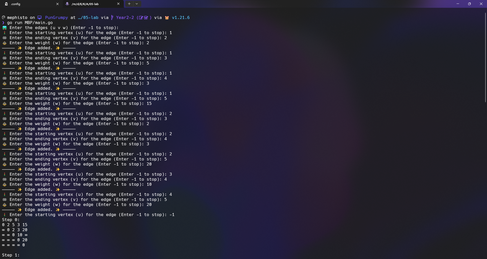
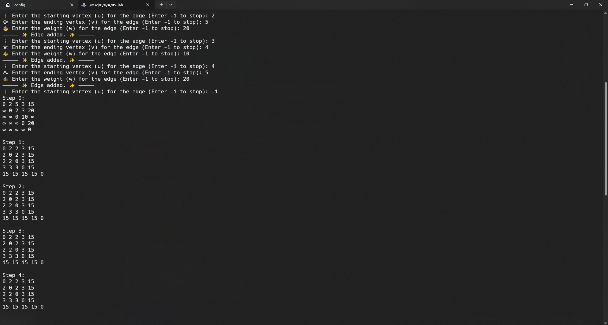

<div align="center">
    <h1>BottleNeck Path</h1>
    <sub>Program to find the bottleneck path in a network</sub>
    <br />
    <br />
    
    
</div>

## 📖 Description

โปรแกรมนี้เป็นโปรแกรมที่ใช้ในการหาทางที่มีความแคบที่สุดในเครือข่าย โดยโปรแกรมจะรับข้อมูลเข้ามาเป็นรูปแบบของเครือข่าย และจะแสดงผลลัพธ์ออกมาเป็นทางที่มีความแคบที่สุดในเครือข่าย

### 1. สร้าง Graph

โปรแกรมจะทำการสร้างโครงสร้าง Graph เพื่อแทนการเชื่อมต่อระหว่างจุดที่ต่างกัน

- โครงสร้างของ Graph ประกอบด้วยจำนวนของจุดที่เชื่อมโยงและ Array 2 มิติ edges เพื่อแทนการเชื่อมต่อระหว่างจุด

```go
type Graph struct {
	V     int
	Edges [][]int
}
```

- Function ที่ใช้ในการสร้าง Graph

```go
func newGraph() *Graph {
	return &Graph{
		V:     0,
		Edges: make([][]int, 0),
	}
}
```

- Function ที่ใช้ในการเพิ่มจุดใน Graph

```go
func (g *Graph) addEdge(u, v, w int) {
	g.Edges = append(g.Edges, []int{u, v, w})
	g.V = int(math.Max(float64(g.V), float64(u)))
	g.V = int(math.Max(float64(g.V), float64(v)))
}
```

### 2. หาทางที่มีความแคบที่สุด

โปรแกรมจะทำการหาทางที่มีความแคบที่สุดโดยจะทำการหาทางที่มีความแคบที่สุดโดยการเปรียบเทียบระยะทางระหว่างจุดที่เชื่อมโยงกันและจุดที่เชื่อมโยงกับจุดอื่นๆ โดยจะเปรียบเทียบระยะทางระหว่างจุดที่เชื่อมโยงกันและจุดที่เชื่อมโยงกับจุดอื่นๆ และเลือกค่าที่มีค่าน้อยที่สุด

```go
func bottleNeckPath(g *Graph, distances [][]int) [][]int {
	for k := 1; k <= g.V; k++ {
		for i := 1; i <= g.V; i++ {
			for j := 1; j <= g.V; j++ {
				tmp := int(math.Min(float64(distances[i][j]), math.Max(float64(distances[i][k]), float64(distances[k][j]))))
				distances[i][j] = tmp
				distances[j][i] = tmp
			}
		}
	}
	return distances
}
```

### 3. แสดงผลลัพธ์

โปรแกรมจะแสดงผลลัพธ์ออกมาเป็นทางที่มีความแคบที่สุดในเครือข่าย

```go
func displayMatrix(matrix [][]int, step int) {
	fmt.Printf("Step %d:\n", step)
	for i := 1; i <= len(matrix)-1; i++ {
		for j := 1; j <= len(matrix[i])-1; j++ {
			if matrix[i][j] == inf {
				fmt.Printf("∞ ")
				continue
			}
			fmt.Printf("%d ", matrix[i][j])
		}
		fmt.Println()
	}
	fmt.Println()
}
```

### 4. รับข้อมูลเข้ามาจาก user

โปรแกรมจะรับข้อมูลเข้ามาเป็นรูปแบบของเครือข่าย โดยจะรับข้อมูลเข้ามาเป็นจำนวนของจุดที่เชื่อมโยงกันและจะรับข้อมูลเข้ามาเป็นจำนวนของจุดที่เชื่อมโยงกันและระยะทางระหว่างจุดที่เชื่อมโยงกัน

```go
func getUserInput(prompt string) int {
	var input int
	fmt.Print(prompt)
	_, err := fmt.Scanln(&input)
	if err != nil {
		fmt.Println("Please enter a valid number.")
		return getUserInput(prompt)
	}
	return input
}
```

```go
func main() {
	g := newGraph()

	fmt.Println("🛤️ Enter the edges (u v w) (Enter -1 to stop):")
	for {
		u := getUserInput("🚦 Enter the starting vertex (u) for the edge (Enter -1 to stop): ")
		if u == -1 {
			break
		}

		v := getUserInput("🏁 Enter the ending vertex (v) for the edge (Enter -1 to stop): ")
		if v == -1 {
			break
		}

		w := getUserInput("⚖️ Enter the weight (w) for the edge (Enter -1 to stop): ")
		if w == -1 {
			break
		}

		g.addEdge(u, v, w)
		fmt.Println("————— ✨ Edge added. ✨ —————")
	}

	distances := make([][]int, g.V+1)
	for i := range distances {
		distances[i] = make([]int, g.V+1)
	}

	for i := 1; i <= g.V; i++ {
		for j := 1; j <= g.V; j++ {
			if i == j {
				distances[i][j] = 0
			} else {
				distances[i][j] = inf
			}
		}
	}

	for _, edge := range g.Edges {
		distances[edge[0]][edge[1]] = edge[2]
	}

	fmt.Println("\n🍶 Bottleneck paths:")

	for k := 0; k < g.V; k++ {
		displayMatrix(distances, k)
		distances = bottleNeckPath(g, distances)
	}
}
```

## 📝 Author

- Name: นพกร แก้วสลับนิล
- Student ID: 65050437
- Sec: 2
