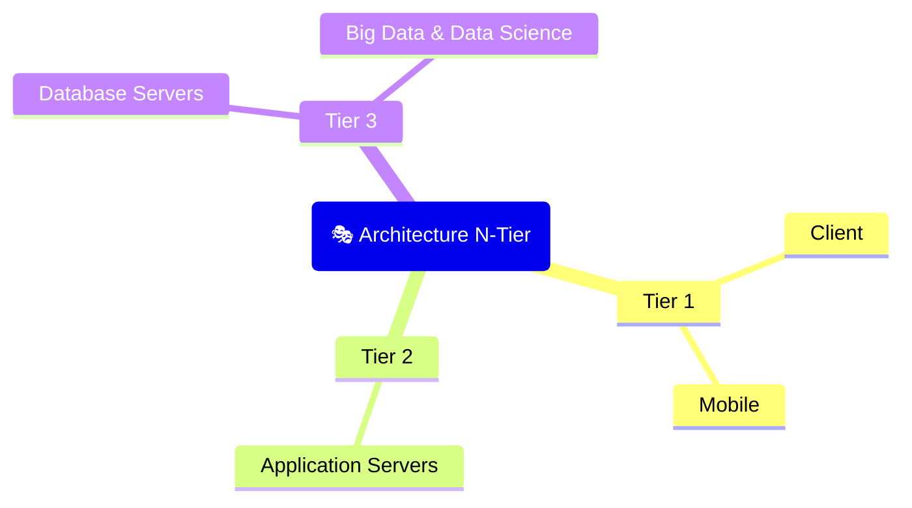

<div align="center">
    <h1><code>🏬</code> Database Systems</h1>
</div>

## `📚` Table of Contents

- [Database Basics](#-database-basics)
  - [What is Database?](#-what-is-database)
  - [Key](#-key)
  - [Database Management System (DBMS)](#-database-management-system-dbms)
  - [Architecture N-Tier](#-architecture-n-tier)
- [SQL Basics](#-sql-basics)
  - [Where](#-where)
  - [Order By](#-order-by)
  - [Group By](#-group-by)
  - [Having](#-having)
  - [Limit](#-limit)
  - [Aggregate Function](#-aggregate-function)
  - [Alias](#-alias)
  - [Join](#-join)
  - [Sub Query](#-sub-query)
  - [Expression](#-expression)
- [Normalization](#-normalization)
  - [First Normal Form (1NF)](#-first-normal-form-1nf)
  - [Second Normal Form (2NF)](#-second-normal-form-2nf)
  - [Third Normal Form (3NF)](#-third-normal-form-3nf)
  - [Boyce-Codd Normal Form (BCNF)](#-boyce-codd-normal-form-bcnf)
  - [Fourth Normal Form (4NF)](#-fourth-normal-form-4nf)
  - [Fifth Normal Form (5NF)](#-fifth-normal-form-5nf)

## `🏪` Database Basics

### `❓` What is Database?

แหล่งเก็บข้อมูลและความสัมพันธ์ระหว่างข้อมูล โดยได้รับการออกแบบตามหลักการที่เป็นวิทยาศาสตร์ เพื่อให้มีความซ้ำซ้อนของข้อมูลน้อยที่สุด และเพื่อให้เกิดความถูกต้องของข้อมูลสูงที่สุด

### `🔐` Key

#### `🗝️` Super Key

Column หรือ Group of column มีคุณสมบัติที่ uniqueness

#### `🗝️` Candidate Key

Column หรือ Group of column ที่มีคุณสมบัติที่ uniqueness และ minimality

#### `🗝️` Primary Key

Candidate Key ที่ถูกเลือกมาใช้งาน โดยมีเงื่อนไขดังนี้

- เหมาะสมกับการใช้งาน
- ง่ายต่อการเข้าถึง

#### `🗝️` Alternate Key

Candidate Key ที่ไม่ได้เป็น Primary Key

#### `🗝️` Foreign Key

Column หรือ Group of column ที่มีคุณสมบัติที่เป็น Primary Key ของตารางอื่น

### `📚` Database Management System (DBMS)

- ระบบจัดการฐานข้อมูล คือ โปรแกรมที่ใช้ในการจัดการฐานข้อมูล
- โปรแกรมที่ใช้ในการจัดการฐานข้อมูล จะมีความสามารถในการจัดการฐานข้อมูล และ จัดการข้อมูลในฐานข้อมูล

### `🎭` Architecture N-Tier



#### `🖥️` Tier 1

- เป็นส่วนที่จะนำเสนอ interface ให้กับผู้ใช้งาน และมี layer ที่จะเชื่อมต่อกับ Application Servers ซึ่งผู้ใช้งานสามารถตอบโต้กับ Application Servers ได้
- ตัวอย่างเช่น Web Application, Mobile Application

#### `🫙` Tier 2

- เป็นส่วนที่จะเป็นตัวกลางในการจัดการข้อมูล และ การประมวลผลข้อมูล โดยจะมี layer ที่จะเชื่อมต่อกับ Database Server ซึ่ง Application Servers สามารถตอบโต้กับ Database Server ได้
- ตัวอย่างเช่น Web Service, API

#### `🏬` Tier 3

- เป็นส่วนที่จะเป็นตัวจัดการฐานข้อมูล โดยจะมี layer ที่จะเชื่อมต่อกับ Big Data & Data Science ซึ่ง Database Server สามารถตอบโต้กับ Big Data & Data Science ได้
- ตัวอย่างเช่น MySQL, PostgreSQL, MongoDB, Redis, Cassandra

#### `📊` Tier N

- เป็นส่วนที่จะเป็นตัวจัดการข้อมูลที่มีขนาดใหญ่ โดยจะมี layer ที่จะเชื่อมต่อกับ Tier 3 ซึ่ง Big Data & Data Science สามารถตอบโต้กับ Tier 3 ได้
- ตัวอย่างเช่น Hadoop, Spark, Kafka, ElasticSearch

## `⚾` SQL Basics

### `🥄` Where

- ใช้ในการเลือกข้อมูลที่ต้องการ

```sql
SELECT column1, column2, ...
FROM table_name
WHERE condition;
```

### `🥄` Order By

- ใช้ในการเรียงลำดับข้อมูล

```sql
SELECT column1, column2, ...
FROM table_name
ORDER BY column1, column2, ... ASC|DESC;
```

> **Note**
> ASC คือ เรียงจากน้อยไปมาก, DESC คือ เรียงจากมากไปน้อย

### `🥄` Group By

- ใช้ในการจัดกลุ่มข้อมูล

```sql
SELECT column1, column2, ...
FROM table_name
GROUP BY column1, column2, ...;
```

> **Note**
> ใช้คู่กับ Aggregate Function เช่น `COUNT`, `SUM`, `AVG`, `MIN`, `MAX`
> ใช้คู่กับ `HAVING` เพื่อเลือกข้อมูลที่ต้องการ
> ใช้คู่กับ `ORDER BY` เพื่อเรียงลำดับข้อมูล

> **Warning**
> ใช้คู่กับ `HAVING` และ `ORDER BY` ต้องเรียงลำดับก่อนจึงจะใช้ `HAVING` ได้

### `🥄` Having

- ใช้ในการเลือกข้อมูลที่ต้องการ

```sql
SELECT column1, column2, ...
FROM table_name
GROUP BY column1, column2, ...
HAVING condition;
```

> **Warning** > `HAVING` vs `WHERE` ควรใช้ `WHERE` ก่อนจึงจะใช้ `HAVING` ได้

### `🥄` Limit

- ใช้ในการจำกัดจำนวนข้อมูลที่ต้องการ

```sql
SELECT column1, column2, ...
FROM table_name
LIMIT number;
```

> **Note**
> ใช้คู่กับ `ORDER BY` เพื่อเรียงลำดับข้อมูล

### `🥄` Aggregate Function

- ใช้ในการคำนวณข้อมูล

```sql
SELECT COUNT(column_name)
FROM table_name;
```

| Function | Description                                                                       |
| -------- | --------------------------------------------------------------------------------- |
| COUNT()  | นับจำนวนข้อมูลทั้งหมด                                                             |
| SUM()    | บวกข้อมูลทั้งหมด                                                                  |
| AVG()    | หาค่าเฉลี่ยข้อมูลทั้งหมด                                                          |
| MIN()    | หาค่าน้อยที่สุดข้อมูลทั้งหมด                                                      |
| MAX()    | หาค่ามากที่สุดข้อมูลทั้งหมด                                                       |
| FIRST()  | หาค่าแรกของข้อมูลทั้งหมด                                                          |
| LAST()   | หาค่าสุดท้ายของข้อมูลทั้งหมด                                                      |
| STDDEV() | หาค่าเบี่ยงเบนมาตรฐานของข้อมูลทั้งหมด (ค่าเฉลี่ยของความห่างของข้อมูลจากค่าเฉลี่ย) |
| VAR()    | หาค่าความแปรปรวนของข้อมูลทั้งหมด (ค่าเฉลี่ยของความห่างของข้อมูลจากค่าเฉลี่ย)      |

### `🥄` Alias

- ใช้ในการตั้งชื่อให้กับ Column หรือ Table

```sql
SELECT column_name AS alias_name
FROM table_name AS alias_name;
```

> **Note**
> ใช้คู่กับ `JOIN` เพื่อเลือกข้อมูลที่ต้องการ

### `🥄` Join

#### `📚` Inner Join

- join ข้อมูลที่มีค่าที่ตรงกันเท่านั้น

```sql
SELECT *
FROM table1
INNER JOIN table2 ON table1.column_name = table2.column_name;
```

#### `📚` Left Join

join ข้อมูลจาก table ด้านซ้าย และข้อมูลที่ตรงที่กันจาก table ด้านขวา

```sql
SELECT *
FROM table1
LEFT JOIN table2 ON table1.column_name = table2.column_name;
```

#### `📚` Right Join

join ข้อมูลจาก table ด้านขวา และข้อมูลที่ตรงที่กันจาก table ด้านซ้าย

```sql
SELECT *
FROM table1
RIGHT JOIN table2 ON table1.column_name = table2.column_name;
```

#### `📚` Full Join

join ข้อมูลทั้งหมดจากทั้ง 2 table โดยแสดงข้อมูลที่ตรงกัน และข้อมูลที่ไม่ตรงกัน

```sql
SELECT *
FROM table1
FULL JOIN table2 ON table1.column_name = table2.column_name;
```

#### `📚` Cross Join

join ข้อมูลทั้งหมดจากทั้ง 2 table โดยไม่มีเงื่อนไข

```sql
SELECT *
FROM table1
CROSS JOIN table2;
```

### `🥄` Sub Query

- ใช้ในการเลือกข้อมูลที่ต้องการ

#### `📚` Regular Sub Query

```sql
SELECT column1, column2, ...
FROM table_name AS table_name_1
WHERE column_name EXPRESSION (
    SELECT column_name
    FROM table_name AS table_name_2
    WHERE condition
);
```

#### `📚` Correlated Sub Query

```sql
SELECT column1, column2, ...
FROM table_name AS table_name_1
WHERE column_name EXPRESSION (
    SELECT column_name
    FROM table_name AS table_name_2
    WHERE table_name_1.column_name = table_name_2.column_name
);
```

> **Note**
> EXPRESSION คือ เครื่องหมายทางคณิตศาสตร์ เช่น `=`, `!=`, `>`, `<`, `>=`, `<=`, `IN`, `BETWEEN`, `LIKE`, `IS NULL`, `IS NOT NULL`

### `🥄` Expression

#### `📚` IN

- เลือกข้อมูลที่มีค่าตรงกับข้อมูลใน list

```sql
SELECT column1, column2, ...
FROM table_name
WHERE column_name IN (value1, value2, ...);
```

#### `📚` BETWEEN

- เลือกข้อมูลที่มีค่าอยู่ระหว่างข้อมูลใน list

```sql
SELECT column1, column2, ...
FROM table_name
WHERE column_name BETWEEN value1 AND value2;
```

#### `📚` LIKE

- เลือกข้อมูลที่มีค่าตรงกับข้อมูลใน list

```sql
SELECT column1, column2, ...
FROM table_name
WHERE column_name LIKE pattern;
```

| Pattern | Description                                                              |
| ------- | ------------------------------------------------------------------------ |
| %       | คือ 0 หรือมากกว่า 0 ตัวอักษร และ คือ 0 หรือมากกว่า 0 ตัวอักษร หรือ ไม่มี |
| \_      | คือ 1 ตัวอักษร และ คือ 1 ตัวอักษร หรือ ไม่มี                             |

> **Note**
> Pattern Example `%a%` คือ ค่าที่มี a อยู่ในตัวแปรที่เราเลือก

## `🧑‍💼` Normalization

| Normal Form | Description                                                                                        |
| ----------- | -------------------------------------------------------------------------------------------------- |
| 1NF         | A relation is in 1NF if and only if all data items are atomic values                               |
| 2NF         | A relation is in 2NF if and only if it is in 1NF and every non-key attribute is fully functionally |
| 3NF         | A relation is in 3NF if and only if it is in 2NF and every non-key attribute is non-transitively   |
| BCNF        | A relation is in BCNF if and only if it is in 3NF and every determinant is a candidate key         |
| 4NF         | A relation is in 4NF if and only if it is in BCNF and has no multi-valued dependencies             |
| 5NF         | A relation is in 5NF if and only if it is in 4NF and every join dependency is a consequence of key |

### `📄` Raw Data

**Supply Parts Database**

| S#  | SNAME | CITY   | STATUS | P#  | PNAME | COLOR | QTY |
| --- | ----- | ------ | ------ | --- | ----- | ----- | --- |
| S1  | Smith | London | 20     | P1  | Nut   | Red   | 200 |
| S2  | Jones | Paris  | 10     | P2  | Screw | Blue  | 400 |
|     |       |        |        | P5  | Cam   | Blue  | 100 |
| S3  | Blake | Paris  | 30     | P3  | Screw | Blue  | 200 |
|     |       |        |        | P4  | Screw | Red   | 500 |
| S4  | Clark | London | 20     | P6  | Cog   | Red   | 300 |
| S5  | Adams | Athens | 30     | P1  | Nut   | Red   | 100 |
|     |       |        |        | P2  | Bolt  | Green | 200 |
|     |       |        |        | P3  | Screw | Blue  | 200 |
|     |       |        |        | P4  | Screw | Red   | 800 |
|     |       |        |        | P5  | Cam   | Blue  | 500 |
|     |       |        |        | P6  | Cog   | Red   | 200 |

### `📚` First Normal Form (1NF)

- A relation **R** is in **1NF** if and only if all data items are atomic values
- ตารางใดที่มีคุณสมบัติ **1NF** จะต้องไม่มีกลุ่มซ้ำของ **Column** ในแต่ละ **Row**

| 💡 ไม่มีกลุ่มซ้ำของ Column/Attribute ใน Row |
| ------------------------------------------- |

**Supply Parts**

| S#  | SNAME | CITY   | STATUS | P#  | PNAME | COLOR | QTY |
| --- | ----- | ------ | ------ | --- | ----- | ----- | --- |
| S1  | Smith | London | 20     | P1  | Nut   | Red   | 200 |
| S2  | Jones | Paris  | 10     | P2  | Screw | Blue  | 400 |
| S2  | Jones | Paris  | 10     | P5  | Cam   | Blue  | 100 |
| S3  | Blake | Paris  | 30     | P3  | Screw | Blue  | 200 |
| S3  | Blake | Paris  | 30     | P4  | Screw | Red   | 500 |
| S4  | Clark | London | 20     | P6  | Cog   | Red   | 300 |
| S5  | Adams | Athens | 30     | P1  | Nut   | Red   | 100 |
| S5  | Adams | Athens | 30     | P2  | Bolt  | Green | 200 |
| S5  | Adams | Athens | 30     | P3  | Screw | Blue  | 200 |
| S5  | Adams | Athens | 30     | P4  | Screw | Red   | 800 |
| S5  | Adams | Athens | 30     | P5  | Cam   | Blue  | 500 |
| S5  | Adams | Athens | 30     | P6  | Cog   | Red   | 200 |

### `📚` Second Normal Form (2NF)

- A relation **R** is in **2NF** if and only if it is in **1NF** and every non-key attribute is **fully functionally dependent** on the primary key
- ตารางใดที่มีคุณสมบัติ **2NF** จะต้องมีคุณสมบัติ **1NF** และมีความสัมพันธ์ **Fully Functional Dependent** กับ **Primary Key**

| 💡 (FFD) มอง X(Key Attribute) กำหนดค่า(Determine) Y(Non Key) |
| ------------------------------------------------------------ |

> **Note**
> Functionally Dependency (FD) is Functional depends on attribute(s) R.x in Relation R (R.x -> R.y) if and only if given a single value of x, there must be onlyone corresponding value of Y \
> ค่า X เป็นตัวกำหนดค่า Y หรือ ค่า Y ขึ้นอยู่กับค่า X (เช่น รหัสนักศึกษา ขึ้นอยู่กับ ชื่อนักศึกษา)

> **Note**
> Fully Functionally Dependency (FFD) is Functional depends on R.x and not on any proper subset of R.x \
> ค่า Y จะต้องขึ้นกับค่า X เท่านั้น และไม่ขึ้นกับค่าใดๆ ที่เป็นส่วนหนึ่งของ X เมื่อ X, Y ประกอบด้วย Column หลายๆ Column (ขอตัวมันจริงๆ เช่น ✔️ รหัสนักศึกษา ✖️ รหัสนักศึกษา และ ชื่อนักศึกษา)

**Supplier**

| S#  | SNAME | CITY   | STATUS |
| --- | ----- | ------ | ------ |
| S1  | Smith | London | 20     |
| S2  | Jones | Paris  | 10     |
| S3  | Blake | Paris  | 30     |
| S4  | Clark | London | 20     |
| S5  | Adams | Athens | 30     |

**Parts**

| P#  | PNAME | COLOR |
| --- | ----- | ----- |
| P1  | Nut   | Red   |
| P2  | Bolt  | Green |
| P3  | Screw | Blue  |
| P4  | Screw | Red   |
| P5  | Cam   | Blue  |
| P6  | Cog   | Red   |

**Supply**

| S#  | P#  | QTY |
| --- | --- | --- |
| S1  | P1  | 200 |
| S2  | P3  | 400 |
| S2  | P5  | 100 |
| S3  | P3  | 200 |
| S3  | P4  | 500 |
| S4  | P6  | 300 |
| S5  | P1  | 100 |
| S5  | P2  | 200 |
| S5  | P3  | 200 |
| S5  | P4  | 800 |
| S5  | P5  | 500 |
| S5  | P6  | 200 |

> **Warning**
> ตาราง Supplier และ Parts มี Primary Key อยู่แล้ว แต่ตาราง Supply ไม่มี Primary Key จึงต้องทำการสร้าง Primary Key ใหม่ขึ้นมา

### `📚` Third Normal Form (3NF)

- A relation is in **3NF** if and only if it is in **2NF** and every non-key attribute is **non-transitively dependent** on the primary key (Dependencies between non-key attributes)
- ตารางใดที่มีคุณสมบัติ **3NF** จะต้องมีคุณสมบัติ **2NF** และ non-key แต่ละตัว ห้ามมีค่าขึ่นกับค่าของ Column อื่นๆ ที่เป็น non-key ด้วย

| 💡 มอง Non Key ห้ามมี FFD ระหว่างกัน |
| ------------------------------------ |

**Supplier**

| S#  | SNAME | CITY   |
| --- | ----- | ------ |
| S1  | Smith | London |
| S2  | Jones | Paris  |
| S3  | Blake | Paris  |
| S4  | Clark | London |
| S5  | Adams | Athens |

**Supplier Status**

| CITY   | STATUS |
| ------ | ------ |
| London | 20     |
| Paris  | 10     |
| Athens | 30     |

**Parts**

| P#  | PNAME | COLOR |
| --- | ----- | ----- |
| P1  | Nut   | Red   |
| P2  | Bolt  | Green |
| P3  | Screw | Blue  |
| P4  | Screw | Red   |
| P5  | Cam   | Blue  |
| P6  | Cog   | Red   |

**Supply**

| S#  | P#  | QTY |
| --- | --- | --- |
| S1  | P1  | 200 |
| S2  | P3  | 400 |
| S2  | P5  | 100 |
| S3  | P3  | 200 |
| S3  | P4  | 500 |
| S4  | P6  | 300 |
| S5  | P1  | 100 |
| S5  | P2  | 200 |
| S5  | P3  | 200 |
| S5  | P4  | 800 |
| S5  | P5  | 500 |
| S5  | P6  | 200 |

> **Note**
> Foreign Key คือ ค่าที่อ้างอิงจากตารางอื่น ๆ และต้องมีค่าที่อ้างอิงอยู่ในตารางที่อ้างอิงด้วย เช่น City.Supplier = City.Supplier Status, S#.Supplier = S#.Supply, P#.Parts = P#.Supply

### `📚` Boyce-Codd Normal Form (BCNF)

- A relation is in **BCNF** if and only if it is in **3NF** and every determinant is a candidate key
- ตารางใดที่มีคุณสมบัติ **BCNF** จะต้องมีคุณสมบัติ **3NF** และมีค่าที่เป็น **Determinant** เป็น **Candidate Key**

**BCNF** จากตาราง [**Supply Parts**](#📄-raw-data) จะเขียน **Functional Dependency** ออกมาได้ดังนี้

| S# is Primary Key | SNAME is Primary Key |
| ----------------- | -------------------- |
| S# → SNAME        | SNAME → S#           |
| S# → FNAME        | SNAME → CITY         |
| ~~S# → STATUS~~   | ~~SNAME → STATUS~~   |
| CITY → STATUS     | CITY → STATUS        |
| P# → PART         | P# → PART            |
| P# → COLOR        | P# → COLOR           |
| (S#, P#) → QTY    | (SNAME, P#) → QTY    |

> **Note**
> Candidate Key คือ ค่าที่เป็น Primary Key ที่เป็นไปได้ทั้งหมด

### `📚` Fourth Normal Form (4NF)

- A relation R is in **4NF** if and only if, whenever there exist an **MVD (Multi-Valued Dependency)** in R, X ->-> Y, then X is a superkey of R. Fact FDS are a special case of MVDs, so all 4NF relations are also in BCNF
- ตารางใดที่มีคุณสมบัติ **4NF** จะต้องมีคุณสมบัติ **BCNF** และมีค่าที่เป็น **MVD** เป็น **Super Key** ของตาราง

| 💡 ถ้าแยกหรือตารางย่อยออกได้ และไม่มีข้อมูลที่หายไป จากนั้น join กลับมาได้เหมือนเดิม และ 4NF คือตารางที่ไม่สามารถแยกหรือตารางย่อยออกได้ |
| --------------------------------------------------------------------------------------------------------------------------------------- |

> **Note**
> Splitable Check คือ การตรวจสอบว่า ค่าที่อยู่ใน Column นั้นๆ สามารถแยกออกได้หรือไม่

> **Note**
> Multi-Valued Dependency (MVD) คือการแยกค่าใน Column ออกเป็นหลายๆ และเวลา join ตารางกลับมาต้องไม่มีข้อมูลที่หายไป หรือ ตารางเหมือนเดิม เช่น ตาราง Supplier และ Supplier Status สามารถแยกออกได้ และเวลา join กลับมาจะไม่มีข้อมูลที่หายไป หรือ ตารางเหมือนเดิม

> **Warning**
> ในการ split column ควรเลือก column ที่มีจำนวน Row เป็นจำนวนคู่ และไม่นับ จำนวน Row ที่เป็น 1 เป็นเลขคี่

**Example**

| S_No | P_No | Qty |
| ---- | ---- | --- |
| S1   | P1   | 20  |
| S1   | P2   | 15  |
| S2   | P1   | 20  |

**Split 1st**

| S_No | P_No |
| ---- | ---- |
| S1   | P1   |
| S1   | P2   |
| S2   | P1   |

**Split 2nd**

| S_No | Qty |
| ---- | --- |
| S1   | 20  |
| S1   | 15  |
| S2   | 20  |

**Natural Join** ⚠️ ไม่สามารถ join กลับมาและได้ข้อมูลเหมือนเดิมได้

| S_No | P_No | Qty |
| ---- | ---- | --- |
| S1   | P1   | 20  |
| S1   | P1   | 15  |
| S1   | P2   | 20  |
| S1   | P2   | 15  |
| S2   | P1   | 20  |

### `📚` Fifth Normal Form (5NF)

- A relation R is in **5NF**, also called **Project-Join Normal Form (PJ/NF)**, if and only if every **join dependecy (JD)** in R is a consequence of the candidate keys of R
- ตารางใดที่มีคุณสมบัติ **5NF** จะต้องมีคุณสมบัติ **4NF** และมีค่าที่เป็น **JD** เป็น **Candidate Key** ของตาราง

| 💡 ตารางหนึ่งตารางที่แบ่ง/ย่อยออกเป็นหลายๆ ตาราง แล้ว join กลับมาได้เหมือนเดิม และ มี Candidate Key ที่เป็น JD ของตาราง (CK ติดไปทุกตารางย่อย)
| --------------------------------------------------------------------------------------------------------------------------------------- |

> **Note**
> Join Dependency (JD) คือความสัมพันธ์ระหว่าง Attribute ในตาราง โดยมีค่าที่เป็น Candidate Key ของตารางนั้นๆ เช่น ตาราง Supplier และ Supplier Status สามารถแยกออกได้ และเวลา join กลับมาจะไม่มีข้อมูลที่หายไป หรือ ตารางเหมือนเดิม

> **Note**
> Project-Join Normal Form (PJ/NF) เป็นรูปแบบปกติที่ใช้ประเมินโครงสร้าง โดยใช้ JD มาเป็นตัววัด และ 5NF คือตารางที่ไม่สามารถแยกหรือตารางย่อยออกได้

**Example**

| S_No | S_Name | City | Address |
| ---- | ------ | ---- | ------- |
| S1   | A      | ก    | Ad1     |
| S2   | B      | ก    | Ad2     |
| S3   | C      | ข    | Ad2     |
| S4   | D      | ง    | Ad1     |

**Split 1st**

| S_No | S_Name |
| ---- | ------ |
| S1   | A      |
| S2   | B      |
| S3   | C      |
| S4   | D      |

**Split 2nd**

| S_No | City |
| ---- | ---- |
| S1   | ก    |
| S2   | ก    |
| S3   | ข    |
| S4   | ง    |

**Split 3rd**

| S_No | Address |
| ---- | ------- |
| S1   | Ad1     |
| S2   | Ad2     |
| S3   | Ad2     |
| S4   | Ad1     |

**Natural Join 1st**

| S_No | S_Name | City |
| ---- | ------ | ---- |
| S1   | A      | ก    |
| S2   | B      | ก    |
| S3   | C      | ข    |
| S4   | D      | ง    |

**Natural Join 2nd**

| S_No | City | Address |
| ---- | ---- | ------- |
| S1   | ก    | Ad1     |
| S2   | ก    | Ad2     |
| S3   | ข    | Ad2     |
| S4   | ง    | Ad1     |

**Result**

| S_No | S_Name | City | Address |
| ---- | ------ | ---- | ------- |
| S1   | A      | ก    | Ad1     |
| S2   | B      | ก    | Ad2     |
| S3   | C      | ข    | Ad2     |
| S4   | D      | ง    | Ad1     |

> **Important**
> JD คือ `*((S_No, S_Name), (S_No, City), (S_No, Address))` และ CK คือ **S_No** \
> และเป็น **5NF** ไม่ต้อง split เนื่องจาก **S_No** เป็น CK ที่ติดไปทุกตารางย่อย

```

```
