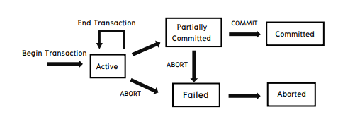

<div align="center">
    <h1><code>🏬</code> Database Systems</h1>
</div>

## `📚` Table of Contents

- [Transaction Processing](#-transaction-processing)
- [Trigger](#-trigger)
- [ER Diagrams](#-er-diagrams)
- [Advanced SQL](#-advanced-sql)

## `📊` ER Diagrams

### `❓` What is ER Diagrams?

แผนภาพที่ใช้ในการแสดงความสัมพันธ์ระหว่าง Entity และ Relationship ของ Database โดยที่ Entity จะเป็นตัวแทนของ Object ที่มีความหมายในโลกจริง และ Relationship คือ ความสัมพันธ์ระหว่าง Entity ที่เกิดขึ้นในโลกจริง

### `❓` ER Diagrams Symbols

- Entity

  

- Relationship

  

### `❓` ER Diagrams Example


## `🚇` Transaction Processing

### `❓` What is Transaction Processing?

การประมวลผลที่เกิดขึ้นในระบบฐานข้อมูล โดยที่การประมวลผลจะเป็นการเขียนข้อมูลลงในฐานข้อมูล หรือ การอ่านข้อมูลจากฐานข้อมูล โดยที่การประมวลผลจะเป็นการทำงานที่เป็นระบบ และ ต้องทำงานในลักษณะที่ถูกต้องและครบถ้วน

### `❓` Transaction Processing Properties

#### `📝` ACID

- Atomicity (อะตอมิซิชั่น)

Transaction จะให้ผลการทำงานเป็นหนึ่งเดียว หรือการทำงานเสร็จอย่างสมบูรณ์ ไม่ว่า Transaction จะทำงานปกติ หรือมีปัญหาก็ตาม หมายความว่า ทุกขั้นตอนของ Transaction จะต้องมีการทำงานที่เสร็จสมบูรณ์ หรือไม่ เช่นนั้นก็ต้องยกเลิกทุกขั้นตอนใน Transaction นั้น หากมีงานบางส่วนใน Transaction ไม่สมบูรณ์จะถูกยกเลิก (Aborted) และจะย้อนกลับ (Rollback) ไปจุด milestone ก่อนหน้านั้น

- Consistency (คอนซิสเทนซี)

ระบบจะรักษาข้อมูลที่เกิดจากการทำงานของ Transaction ให้ถูกต้อง และสอดคล้องกันเสมอ นั่นคือหลังจากการทำงานของ Transaction เสร็จสมบูรณ์ ทุก Transaction จะต้องก่อให้เกิดข้อมูลใน Database ที่มีความถูกต้องเสมอ

- Isolation (ไอโซเลชั่น)

การทำงานของ Transaction จะต้องไม่มีผลกระทบกับ Transaction อื่น ๆ ที่ทำงานพร้อมกัน หรือ ทำงานต่อเนื่องกัน นั่นคือ การทำงานของ Transaction จะต้องไม่มีผลกระทบกับ Transaction อื่น ๆ ที่ทำงานพร้อมกัน หรือ ทำงานต่อเนื่องกัน นั่นคือ การทำงานของ Transaction จะต้องไม่มีผลกระทบกับ Transaction อื่น ๆ ที่ทำงานพร้อมกัน หรือ ทำงานต่อเนื่องกัน

- Durability (ดิวราบิลิตี้)

การทำงานของ Transaction จะต้องมีผลต่อข้อมูลใน Database ในทุก ๆ กรณี นั่นคือ หลังจากที่ Transaction ทำงานเสร็จสมบูรณ์แล้ว ข้อมูลที่เกิดจากการทำงานของ Transaction นั้น ๆ จะต้องถูกเก็บไว้ใน Database อย่างถาวร

#### `📝` Transaction States



- Active

Transaction ที่กำลังทำงานอยู่

- Partially Committed

Transaction ที่ทำงานเสร็จสมบูรณ์แล้ว แต่ยังไม่ได้ Commit ข้อมูลลงใน Database

- Committed

Transaction ที่ทำงานเสร็จสมบูรณ์แล้ว และ Commit ข้อมูลลงใน Database เรียบร้อยแล้ว

- Failed

Transaction ที่ทำงานไม่สมบูรณ์ หรือ ทำงานไม่สำเร็จ

- Aborted

Transaction ที่ทำงานไม่สมบูรณ์ และถูกยกเลิกการทำงาน

#### `📝` Transaction Operations

- Begin Transaction

เป็นการเริ่มต้น Transaction ใหม่

- Commit

เป็นการยืนยัน Transaction ที่ทำงานเสร็จสมบูรณ์ และ Commit ข้อมูลลงใน Database

- Rollback

เป็นการยกเลิก Transaction ที่ทำงานไม่สมบูรณ์ และย้อนกลับไปที่จุดเริ่มต้นของ Transaction นั้น

### `❓` Transaction Processing Example SQL

```sql
BEGIN TRANSACTION;

-- ฝากเงิน
UPDATE saving_accounts
  SET balance = balance - 1000
  WHERE account_number = 3209;

-- ถอนเงิน
UPDATE check_accounts
  SET balance = balance + 1000
  WHERE account_number = 3208;

-- บันทึกข้อมูลการทำรายการ ลงใน journal
INSERT INTO journal VALUES
  (journal_seq.NEXTVAL, '1B'
    3209, 3208, 500);

COMMIT WORK;
```

## `🚇` Trigger

### `❓` What is Trigger?

Trigger คือ การทำงานของโปรแกรมที่ถูกเรียกใช้งานโดยอัตโนมัติ โดยที่ Trigger จะถูกเรียกใช้งานโดยอัตโนมัติ โดยที่ Trigger จะถูกเรียกใช้งานโดยอัตโนมัติ โดยที่ Trigger จะถูกเรียกใช้งานโดยอัตโนมัติ โดยที่ Trigger จะถูกเรียกใช้งานโดยอัตโนมัติ โดยที่ Trigger จะถูกเรียกใช้งานโดยอัตโนมัติ โดยที่ Trigger จะถูกเรียกใช้งานโดยอัตโนมัติ โดยที่ Trigger จะถูกเรียกใช้งานโดยอัตโนมัติ โดยที่ Trigger จะถูกเรียกใช้งานโดยอัตโนมัติ โดยที่ Trigger จะถูกเรียกใช้งานโดยอัตโนมัติ โดยที่ Trigger จะถูกเรียกใช้งานโดยอัตโนมัติ โดยที่ Trigger จะถูกเรียกใช้งานโดยอัตโนมัติ

### `❓` Trigger Example SQL

```sql
CREATE OR REPLACE TRIGGER trigger_name
BEFORE INSERT OR UPDATE OR DELETE ON table_name
FOR EACH ROW
BEGIN
  -- โค้ดที่ต้องการให้ทำงาน
END;
```

- สร้าง Trigger ที่ไว้ตรวจสอบการเพิ่มข้อมูลในตาราง Employee โดยที่จะต้องมีการเพิ่มข้อมูลใน Column Salary ให้มีค่ามากกว่า 10000

```sql
CREATE OR REPLACE TRIGGER trigger_name
BEFORE INSERT OR UPDATE ON Employee
FOR EACH ROW
BEGIN
  IF :NEW.Salary < 10000 THEN
    RAISE_APPLICATION_ERROR(-20001, 'Salary must be greater than 10000');
  END IF;
END;
```

## `📚` Advanced SQL

### `🧑‍💻` Create, Alter, Drop

#### `📝` Create

การสร้างตารางใน Database

```sql
CREATE TABLE table_name (
  column_name1 data_type(size),
  column_name2 data_type(size),
  column_name3 data_type(size),
  ...
);
```

#### `📝` Alter

การเปลี่ยนแปลงโครงสร้างของตารางใน Database

```sql
-- เพิ่ม column
ALTER TABLE table_name
ADD column_name datatype;

-- ลบ column
ALTER TABLE table_name
DROP COLUMN column_name;

-- เปลี่ยนชื่อ column
ALTER TABLE table_name
MODIFY COLUMN column_name datatype;
```

#### `📝` Drop

การลบตารางใน Database

```sql
DROP TABLE table_name;
```

### `🧑‍💻` View

View คือ เป็นการสร้างมุมมองตามสิทธิการใช้งานข้อมูลในตารางต่างๆ ซึ่งอาจร่วมกันมากกว่า 1 ตารางก็ได้ ตามมุมมองของผู้ใช้งาน (External View) ของสถาปัตยกรรม 3 นิยามข้อมูล (The 3 Schema Architecture)

1. มุมมองการใช้งานข้อมูลของ ผู้จัดการแผนกบุคคล ที่ใช้งานข้อมูลทั้งหมดของบริษัท

```sql
CREATE VIEW View_HR_Manager AS
SELECT * FROM Employee WHERE WorkStatus = 'W' ORDER BY 1;
```

2. มุมมองการใช้งานข้อมูลของ ผู้จัดการแผนกคอมพิวเตอร์ (ข้อมูลเฉพาะแผนก โดยให้เห็นข้อมูล ชื่อแผนก รหัสและ ชื่อพนักงาน เพศ เงินเดือน และวันที่เริ่มทำงาน)

```sql
CREATE OR REPLACE VIEW View_IT_Manager AS
SELECT Employee, Department WHERE (WorkStatus = 'W') AND Employee.DeptCode = '50'
AND (Employee.DeptCode = Department.DeptCode)
ORDER BY 1;
```

3. มุมมองการใช้งานข้อมูลของพนักงานแต่ละคน ที่มีนโยบายให้พนักงานสามารถดูข้อมูลของพนักงานคนอื่นได้ โดยให้เห็นข้อมูลเฉพาะ รหัส ชื่อพนักงาน และเพศเท่านั้น

```sql
CREATE OR REPLACE VIEW View_Employee AS
SELECT EmpNo, FName, LName, Sex FROM Employee WHERE WorkStatus = 'W' ORDER BY 1;
```

#### `📝` Create

การสร้าง View ใน Database

```sql
CREATE VIEW view_name AS
SELECT column_name(s)
FROM table_name
WHERE condition;
```

#### `📝` Drop

การลบ View ใน Database

```sql
DROP VIEW view_name;
```

### `🧑‍💻` Index

Index คือ การสร้างดัชนีจะใช้ประโยชน์เพื่อให้ สามารถเข้าถึงข้อมูลในตารางได้รวดเร็วขึ้น (Speed Performance) และควรสร้างบน Column ของตารางขนาดใหญ่ที่มีการใช้งานบ่อยๆ ในส่วนของ `WHERE` และ `ORDER BY` โดยที่จะเป็นการสร้าง Index File ที่มีโครงสร้างเป็น B+ Tree

```sql
CREATE INDEX Employee_Name_Index ON Employee (FName, LName);
CREATE INDEX Employee_Salary_Index ON Employee (Salary * 1.5);
CREATE INDEX Employee_Name_Index ON Department (DeptName DESC);
```

#### `📝` Create

การสร้าง Index ใน Database

```sql
CREATE INDEX index_name
ON table_name (column_name);
```

#### `📝` Drop

การลบ Index ใน Database

```sql
DROP INDEX index_name;
```

### `🧑‍💻` Join

#### `📝` Inner Join

Inner join คือ การเลือกข้อมูลจากตารางที่มีความสัมพันธ์กัน โดยใช้เงื่อนไขที่เป็นจริงทั้งหมด และจะแสดงข้อมูลที่มีความสัมพันธ์กันเท่านั้น

```sql
SELECT column_name(s)
FROM table1
INNER JOIN table2
ON table1.column_name = table2.column_name;
```

#### `📝` Left Join

Left join คือ การเลือกข้อมูลจากตารางที่มีความสัมพันธ์กัน โดยใช้เงื่อนไขที่เป็นจริงทั้งหมด และจะแสดงข้อมูลที่มีความสัมพันธ์กันเท่านั้น แต่ถ้าข้อมูลในตารางที่เลือกมาไม่มีความสัมพันธ์กับตารางอีกตารางหนึ่ง จะแสดงข้อมูลในตารางที่มีความสัมพันธ์กับตารางอีกตารางหนึ่ง แต่ข้อมูลในตารางที่ไม่มีความสัมพันธ์กับตารางอีกตารางหนึ่ง จะแสดงค่า `NULL`

```sql
SELECT column_name(s)
FROM table1
LEFT JOIN table2
ON table1.column_name = table2.column_name;
```

#### `📝` Right Join

Right join คือ การเอาข้อมูลจากตารางที่มีความสัมพันธ์กัน โดยใช้เงื่อนไขที่เป็นจริงทั้งหมด และจะแสดงข้อมูลที่มีความสัมพันธ์กันเท่านั้น แต่ถ้าข้อมูลในตารางที่เลือกมาไม่มีความสัมพันธ์กับตารางอีกตารางหนึ่ง จะแสดงข้อมูลในตารางที่มีความสัมพันธ์กับตารางอีกตารางหนึ่ง แต่ข้อมูลในตารางที่ไม่มีความสัมพันธ์กับตารางอีกตารางหนึ่ง จะแสดงค่า `NULL`

```sql
SELECT column_name(s)
FROM table1
RIGHT JOIN table2
ON table1.column_name = table2.column_name;
```

#### `📝` Full Join

Full join คือ การที่เอาข้อมูลทั้งหมดจากตารางที่มีความสัมพันธ์กัน โดยใช้เงื่อนไขที่เป็นจริงทั้งหมด และจะแสดงข้อมูลที่มีความสัมพันธ์กันเท่านั้น แต่ถ้าข้อมูลในตารางที่เลือกมาไม่มีความสัมพันธ์กับตารางอีกตารางหนึ่ง จะแสดงข้อมูลในตารางที่มีความสัมพันธ์กับตารางอีกตารางหนึ่ง แต่ข้อมูลในตารางที่ไม่มีความสัมพันธ์กับตารางอีกตารางหนึ่ง จะแสดงค่า `NULL`

```sql
SELECT column_name(s)
FROM table1
FULL JOIN table2
ON table1.column_name = table2.column_name;
```

#### `📝` Self Join

Self join คือ การเอาข้อมูลในตารางเดียวกันมาเปรียบเทียบกัน โดยใช้เงื่อนไขที่เป็นจริงทั้งหมด และจะแสดงข้อมูลที่มีความสัมพันธ์กันเท่านั้น

```sql
SELECT column_name(s)
FROM table1 T1, table1 T2
WHERE condition;
```

#### `📝` Cross Join

Cross join คือ การรวม row ระหว่าง 2 Tables โดยจะวนจนครบตามจำนวนของข้อมูลแบบ multiple set หรือเรียกว่า Cartesian product โดยจะนำข้อมูลบน Table หลักแต่ละแถวไปรวมกับข้อมูลของ Table รองทั้งหมด โดยไล่ไปจนถึง row สุดท้ายของ Table หลัก

```sql
SELECT column_name(s)
FROM table1
CROSS JOIN table2;
```

### `🧑‍💻` Subquery

Subquery คือ การเขียน Query ภายใน Query โดยที่ Query ภายในจะเป็น Subquery หรือ Inner Query และ Query ภายนอกจะเป็น Main Query หรือ Outer Query โดยที่ Subquery จะทำงานก่อน Main Query และจะส่งผลลัพธ์ที่ได้จาก Subquery ไปให้ Main Query ดำเนินการต่อ

```sql
SELECT column_name(s)
FROM table_name
WHERE column_name IN (SELECT STATEMENT FROM table_name);
```

#### `📝` Subquery Example

- แสดงข้อมูลของพนักงานที่มีเงินเดือนมากกว่าเงินเดือนของพนักงานที่มีรหัสพนักงานเท่ากับ 1001

```sql
SELECT * FROM Employee WHERE Salary > (SELECT Salary FROM Employee WHERE EmpNo = 1001);
```

- แสดงข้อมูลของพนักงานที่มีเงินเดือนมากที่สุดของแต่ละแผนก และยังต้องทำงานอยู่

```sql
SELECT * FROM Employee WHERE (DeptCode, Salary) IN (SELECT DeptCode, MAX(Salary) FROM Employee WHERE WorkStatus = 'W' GROUP BY DeptCode);
```

- แสดงข้อมูลของพนักงานที่มีเงินเดือนมากที่สุดของแต่ละแผนก และยังต้องทำงานอยู่ โดยใช้ Subquery แบบ Correlated Subquery

```sql
SELECT * FROM Employee E1 WHERE Salary = (SELECT MAX(Salary) FROM Employee E2 WHERE E1.DeptCode = E2.DeptCode AND E2.WorkStatus = 'W');
```
