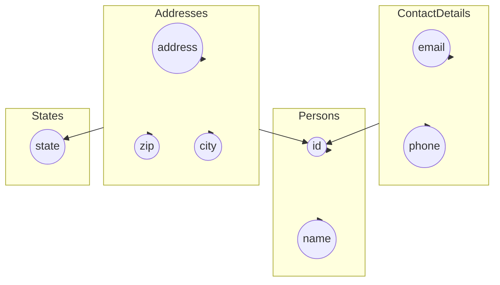

<div align="center">
    <h1>Database Systems</h1>
</div>

<div>
  <h1>Table of Contents</h1>
  <ul role="list">
    <li data-icon="📚"><a href="#📚-sql-basics">SQL Basics</a></li>
    <li data-icon="🏓"><a href="#🏓-normalization">Normalization</a></li>
    <li data-icon="💉"><a href="#💉-sql-queries">SQL Queries</a></li>
  </ul>
</div>

# 📚 SQL Basics

## 📋 SELECT

```sql
SELECT * FROM table_name;
```

## 📋 WHERE

```sql
SELECT * FROM table_name WHERE condition;
```

## 📋 AND, OR, NOT

```sql
SELECT * FROM table_name WHERE condition1 AND condition2;
SELECT * FROM table_name WHERE condition1 OR condition2;
SELECT * FROM table_name WHERE NOT condition;
```

## 📋 ORDER BY

```sql
SELECT * FROM table_name ORDER BY column1, column2 ASC|DESC;
```

## 📋 WHERE

```sql
SELECT * FROM table_name WHERE condition;
```

## 📋 JOIN

```sql
SELECT column_name(s)
FROM table1
INNER JOIN table2 ON table1.column_name = table2.column_name;
```

### 📋 INNER JOIN

```sql
SELECT column_name(s)
FROM table1
INNER JOIN table2 ON table1.column_name = table2.column_name;
```

### 📋 LEFT JOIN

```sql
SELECT column_name(s)
FROM table1
LEFT JOIN table2 ON table1.column_name = table2.column_name;
```

### 📋 RIGHT JOIN

```sql
SELECT column_name(s)
FROM table1
RIGHT JOIN table2 ON table1.column_name = table2.column_name;
```

## 📋 UNION

```sql
SELECT column_name(s) FROM table1
UNION
SELECT column_name(s) FROM table2;
```

## 📋 GROUP BY

```sql
SELECT column_name(s)
FROM table_name
WHERE condition
GROUP BY column_name(s)
ORDER BY column_name(s);
```

## 📋 COUNT

```sql
SELECT COUNT(column_name) FROM table_name;
```

---

# 🏓 Normalization



## Raw Data

| id  | name  | email             | phone        | address     | city       | state | zip   |
| --- | ----- | ----------------- | ------------ | ----------- | ---------- | ----- | ----- |
| 1   | John  | john@doe.com      | 123-456-7890 | 123 Main St | Anytown    | CA    | 12345 |
|     |       | john@example.com  | 012-345-6789 | Main St     | Anytown    | CA    | 12345 |
| 2   | Jane  | jane@doe.com      | 098-765-4321 | 456 Main St | Anytown    | CA    | 12345 |
|     |       | jane@example.com  | 987-654-3210 | 789 Elm St  | Otherville | TX    | 54321 |
| 3   | Alice | alice@smith.com   | 111-222-3333 | 111 Oak Rd  | Woodville  | OH    | 67890 |
|     |       | alice@example.com | 444-555-6666 | Elm St      | Anytown    | CA    | 12345 |

## 📝 First Normal Form (1NF)

- No repeating groups
- Each column has a single value
- Each row has a unique identifier

| id  | name  | email             | phone        | address     | city       | state | zip   |
| --- | ----- | ----------------- | ------------ | ----------- | ---------- | ----- | ----- |
| 1   | John  | john@doe.com      | 123-456-7890 | 123 Main St | Anytown    | CA    | 12345 |
| 1   |       | john@example.com  | 012-345-6789 | Main St     | Anytown    | CA    | 12345 |
| 2   | Jane  | jane@doe.com      | 098-765-4321 | 456 Main St | Anytown    | CA    | 12345 |
| 2   |       | jane@example.com  | 987-654-3210 | 789 Elm St  | Otherville | TX    | 54321 |
| 3   | Alice | alice@smith.com   | 111-222-3333 | 111 Oak Rd  | Woodville  | OH    | 67890 |
| 3   |       | alice@example.com | 444-555-6666 | Elm St      | Anytown    | CA    | 12345 |

## 📝 Second Normal Form (2NF)

- Remove partial dependencies

**Table: Persons**

| id  | name  |
| --- | ----- |
| 1   | John  |
| 2   | Jane  |
| 3   | Alice |

**Table: ContactDetails**

| id  | email             | phone        |
| --- | ----------------- | ------------ |
| 1   | john@doe.com      | 123-456-7890 |
| 1   | john@example.com  | 012-345-6789 |
| 2   | jane@doe.com      | 098-765-4321 |
| 2   | jane@example.com  | 987-654-3210 |
| 3   | alice@smith.com   | 111-222-3333 |
| 3   | alice@example.com | 444-555-6666 |

**Table: Addresses**

| id  | address     | city       | state | zip   |
| --- | ----------- | ---------- | ----- | ----- |
| 1   | 123 Main St | Anytown    | CA    | 12345 |
| 2   | 456 Main St | Anytown    | CA    | 12345 |
| 2   | 789 Elm St  | Otherville | TX    | 54321 |
| 3   | 111 Oak Rd  | Woodville  | OH    | 67890 |
| 3   | Elm St      | Anytown    | CA    | 12345 |

## 📝 Third Normal Form (3NF)

- Remove transitive dependencies

**Table: Persons**

| id  | name  |
| --- | ----- |
| 1   | John  |
| 2   | Jane  |
| 3   | Alice |

**Table: ContactDetails**

| id  | email           | phone        |
| --- | --------------- | ------------ |
| 1   | john@doe.com    | 123-456-7890 |
| 2   | jane@doe.com    | 098-765-4321 |
| 3   | alice@smith.com | 111-222-3333 |

**Table: Addresses**

| id  | address     | city       | zip   |
| --- | ----------- | ---------- | ----- |
| 1   | 123 Main St | Anytown    | 12345 |
| 2   | 456 Main St | Anytown    | 12345 |
| 2   | 789 Elm St  | Otherville | 54321 |
| 3   | 111 Oak Rd  | Woodville  | 67890 |
| 3   | Elm St      | Anytown    | 12345 |

**Table: States**

| state |
| ----- |
| CA    |
| TX    |
| OH    |

---

# 💉 SQL Queries

### 1. List all persons along with their email and phone

```sql
SELECT P.id, P.name, CD.email, CD.phone
FROM Persons P
INNER JOIN ContactDetails CD ON P.id = CD.id;
```

**Result**

| id  | name  | email             | phone        | address     | city       | state | zip   |
| --- | ----- | ----------------- | ------------ | ----------- | ---------- | ----- | ----- |
| 1   | John  | john@doe.com      | 123-456-7890 | 123 Main St | Anytown    | CA    | 12345 |
| 1   |       | john@example.com  | 012-345-6789 | Main St     | Anytown    | CA    | 12345 |
| 2   | Jane  | jane@doe.com      | 098-765-4321 | 456 Main St | Anytown    | CA    | 12345 |
| 2   |       | jane@example.com  | 987-654-3210 | 789 Elm St  | Otherville | TX    | 54321 |
| 3   | Alice | alice@smith.com   | 111-222-3333 | 111 Oak Rd  | Woodville  | OH    | 67890 |
| 3   |       | alice@example.com | 444-555-6666 | Elm St      | Anytown    | CA    | 12345 |

### 2. List addresses in a specific state along with the persons living there

```sql
SELECT A.address, A.city, A.zip, P.name
FROM Addresses A
INNER JOIN Persons P ON A.id = P.id
WHERE A.state = 'CA';
```

**Result**

| address     | city    | zip   | name  |
| ----------- | ------- | ----- | ----- |
| 123 Main St | Anytown | 12345 | John  |
| Main St     | Anytown | 12345 | John  |
| 456 Main St | Anytown | 12345 | Jane  |
| Elm St      | Anytown | 12345 | Alice |

### 3. List states and the number of persons living in each state:

```sql
SELECT A.state, COUNT(P.id) AS person_count
FROM Addresses A
LEFT JOIN Persons P ON A.id = P.id
GROUP BY A.state;
```

**Result**

| state | person_count |
| ----- | ------------ |
| CA    | 4            |
| OH    | 1            |
| TX    | 1            |
