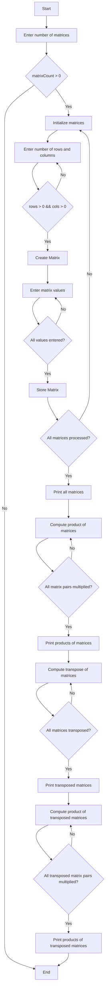

```mermaid
graph TD

A[Start] --> B[Enter number of matrices]
B --> C{matrixCount > 0}
C -- Yes --> D[Initialize matrices]
C -- No --> E[End]

D --> F[Enter number of rows and columns]
F --> G{rows > 0 && cols > 0}
G -- Yes --> H[Create Matrix]
G -- No --> F

H --> I[Enter matrix values]
I --> J{All values entered?}
J -- No --> I
J -- Yes --> K[Store Matrix]
K --> L{All matrices processed?}
L -- No --> D
L -- Yes --> M[Print all matrices]

M --> N[Compute product of matrices]
N --> O{All matrix pairs multiplied?}
O -- No --> N
O -- Yes --> P[Print products of matrices]

P --> Q[Compute transpose of matrices]
Q --> R{All matrices transposed?}
R -- No --> Q
R -- Yes --> S[Print transposed matrices]

S --> T[Compute product of transposed matrices]
T --> U{All transposed matrix pairs multiplied?}
U -- No --> T
U -- Yes --> V[Print products of transposed matrices]
V --> E[End]
```
