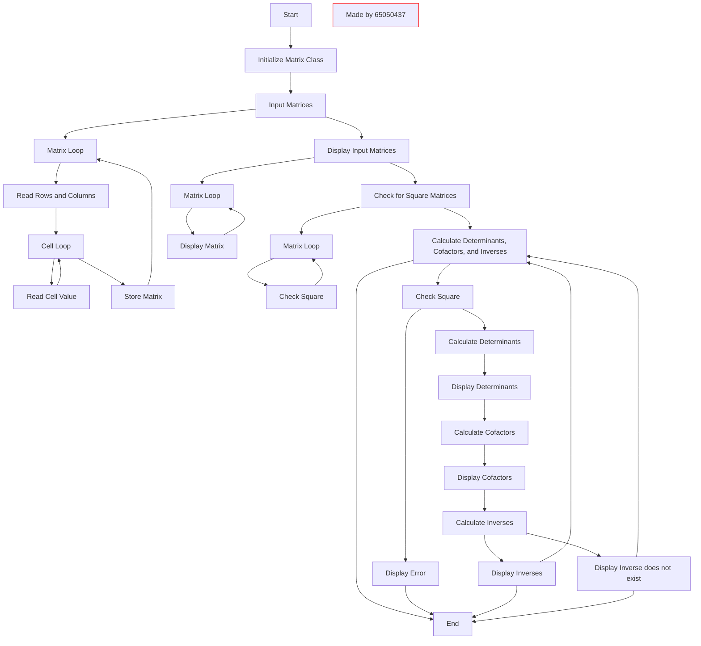

```mermaid
graph TD
    classDef labelStyle stroke:#FF0000;
    A[Start] --> B[Initialize Matrix Class]
    B --> C[Input Matrices]
    C --> D[Display Input Matrices]
    D --> E[Check for Square Matrices]
    E --> F[Calculate Determinants, Cofactors, and Inverses]
    F --> G[End]

    C --> H[Matrix Loop]
    H --> I[Read Rows and Columns]
    I --> J[Cell Loop]
    J --> K[Read Cell Value]
    K --> J
    J --> L[Store Matrix]
    L --> H

    D --> M[Matrix Loop]
    M --> N[Display Matrix]
    N --> M

    E --> O[Matrix Loop]
    O --> P[Check Square]
    P --> O

    F --> Q[Check Square]
    Q --> R[Display Error]
    R --> G
    Q --> S[Calculate Determinants]
    S --> T[Display Determinants]
    T --> U[Calculate Cofactors]
    U --> V[Display Cofactors]
    V --> W[Calculate Inverses]
    W --> X[Display Inverses]
    W --> Y[Display Inverse does not exist]
    X --> F
    Y --> F
    X --> G
    Y --> G

    ID[Made by 65050437]
    class ID labelStyle
```
