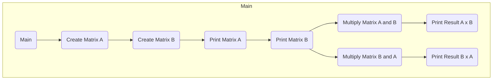

## Flowchart of Lab 1

```mermaid
flowchart TD

subgraph Main
    A(Main)
    B(Create Matrix A)
    C(Create Matrix B)
    D(Print Matrix A)
    E(Print Matrix B)
    F(Multiply Matrix A and B)
    G(Print Result A x B)
    H(Multiply Matrix B and A)
    I(Print Result B x A)
end

A --> B
B --> C
C --> D
D --> E
E --> F
F --> G
E --> H
H --> I
```
