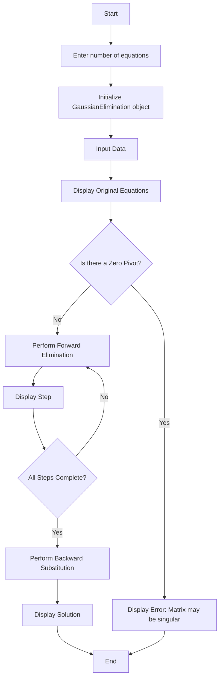

```mermaid
graph TD;
    A[Start] --> B[Enter number of equations];
    B --> C[Initialize GaussianElimination object];
    C --> D[Input Data];
    D --> E[Display Original Equations];
    E --> F{Is there a Zero Pivot?};
    F -- Yes --> G[Display Error: Matrix may be singular];
    F -- No --> H[Perform Forward Elimination];
    H --> I[Display Step];
    I --> J{All Steps Complete?};
    J -- Yes --> K[Perform Backward Substitution];
    J -- No --> H;
    K --> L[Display Solution];
    L --> M[End];
    G --> M[End];
```
