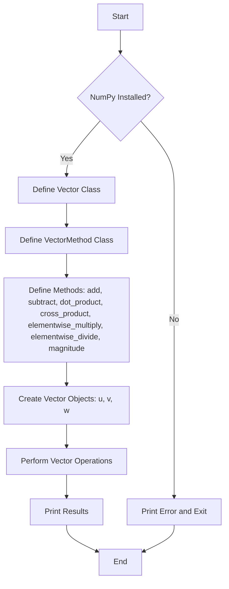

```mermaid
graph TD
    A[Start] --> B{NumPy Installed?}
    B -- Yes --> C[Define Vector Class]
    B -- No --> D[Print Error and Exit]
    C --> E[Define VectorMethod Class]
    E --> F[Define Methods: add, subtract, dot_product, cross_product, elementwise_multiply, elementwise_divide, magnitude]
    F --> G[Create Vector Objects: u, v, w]
    G --> H[Perform Vector Operations]
    H --> I[Print Results]
    I --> J[End]
    D --> J[End]
```
