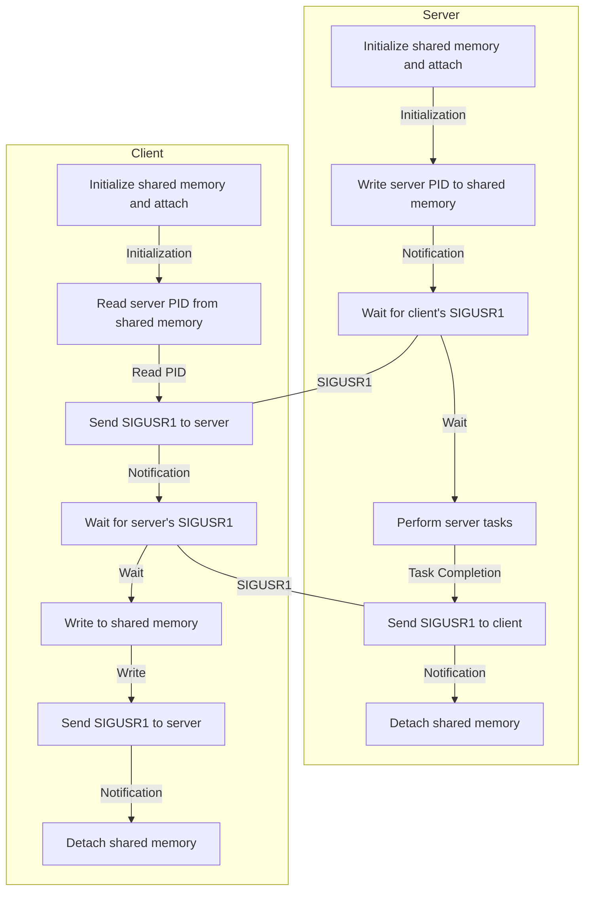

```mermaid
graph TD
  subgraph Server
    A[Initialize shared memory and attach]
    B[Write server PID to shared memory]
    C[Wait for client's SIGUSR1]
    D[Perform server tasks]
    E[Send SIGUSR1 to client]
    F[Detach shared memory]
  end

  subgraph Client
    G[Initialize shared memory and attach]
    H[Read server PID from shared memory]
    I[Send SIGUSR1 to server]
    J[Wait for server's SIGUSR1]
    K[Write to shared memory]
    L[Send SIGUSR1 to server]
    M[Detach shared memory]
  end

  A -->|Initialization| B
  B -->|Notification| C
  C -->|Wait| D
  D -->|Task Completion| E
  E -->|Notification| F

  G -->|Initialization| H
  H -->|Read PID| I
  I -->|Notification| J
  J -->|Wait| K
  K -->|Write| L
  L -->|Notification| M

  C ---|SIGUSR1| I
  J ---|SIGUSR1| E
```
